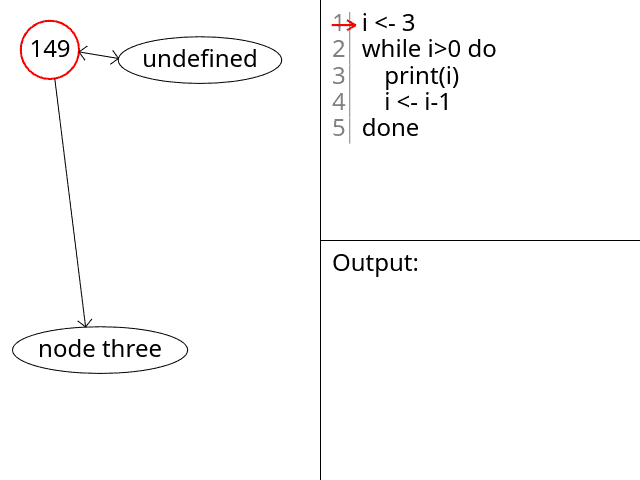

# Algonim

This is an algorithm visualizer that runs in the browser and can make animated GIFs.

It also supports embedding the animation's code directly in the resulting GIF via the use of a custom `Algonim.` [Application Extension block](https://www.w3.org/Graphics/GIF/spec-gif89a.txt).

## Building

Go into the `algonim` directory and run the `build` script with `npm`: `npm run build`.

You can run tests with `npm run test`.

## Usage

To experience Algonim after you've built it locally, simply open `test.html` in a web browser.

New commits on `main` are also automatically built and deployed to the repository's [GitHub Page](https://dit05.github.io/algonim/). You may also find the auto-generated documentation there.
